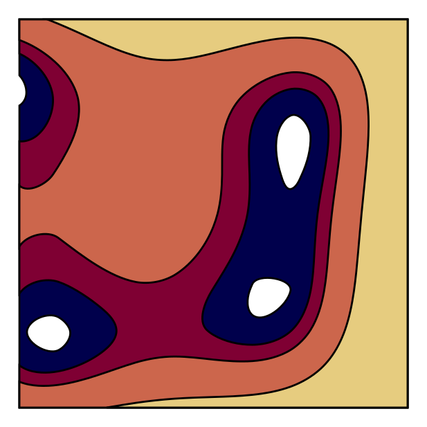
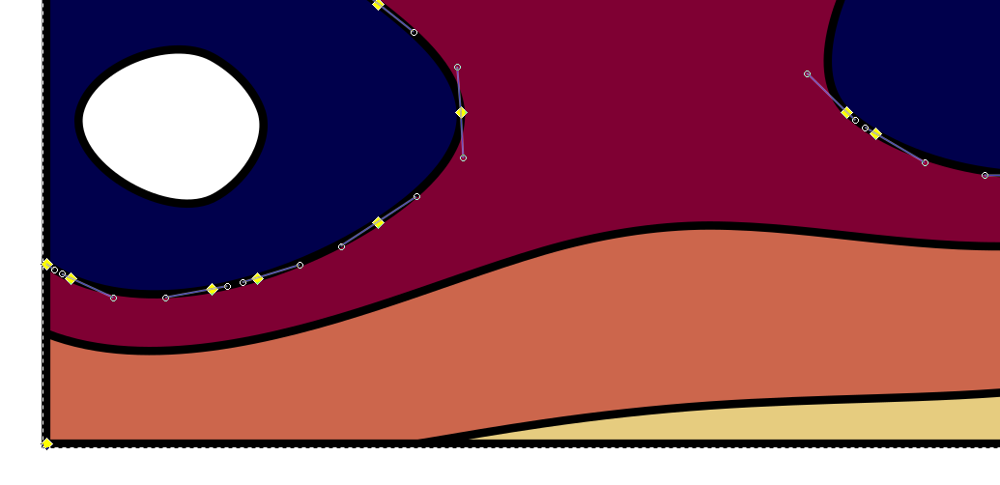

Contouring
==========

This is a small C++ library for plotting contours and/or filled contours.
These are contours of the Himmelblau function. 



The `Contouring` library draws these contours by sampling the function on a
coarse grid and then solving for the function on grid lines, returning a path
by callback to drawing functions. The path follows a smooth curve by calling
a function for bezier splines.



The principal function in this library takes quite few arguments:

```C++
extern "C" void contour(
    double (*f)(double, double), double s,
    double x0, double y0,
    double x1, double y1,
    unsigned n, unsigned m,

    void (*move_to)(double, double),
    void (*line_to)(double, double),
    void (*curve_to)(double, double, double, double, double, double),
    void (*close_path)());
```

The function `f` is being sampled in the range `[x0,x1]⨯[y0,y1]` on a `n⨯m`
grid.  To draw the contour four callback functions need to be given: `move_to`,
`line_to`, `curve_to` and `close_path`. These functions shoud work the same as
those of the same name in the [Cairo drawing library](http://www.cairographics.org/).

Usage
=====

C++
---

Just copy the relevant sources to your own project.

Guile
-----

`Contouring` comes with an interface for the [Guile programming
language](https://www.gnu.org/software/guile/). To compile this interface you
need `guile 2`, and `guile-cairo`.

Python
------

A Python interface is still in the works.

License
=======

This work is distributed under the Apache license v2.
